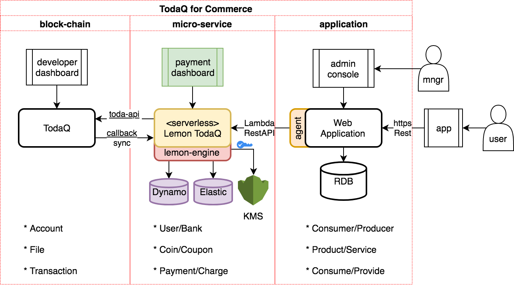

# lemon-todaq-doc

Restfull Micro-Service to support general commerce above toda block-chain.

# Objective

- Support general commerce payment based on [TodaQ API](https://todaqfinance.com/)
- Ready to deploy in AWS Cloud
- Provide a web based admin console for host.

# Requirements

## 유저 (User)

- TYPE: `ACCOUNT`
- Master information about user(or company), which is copied via RDB.
- Encrypt TODAQ's Account Information like `account-id`. (Only `super` user can see).
- Can be synchronized with TODAQ Accounts.
- `total` has total amount of value of conins belonged to user.

1. `연결(link)`: Connect current user with TODAQ's Account (or create new one)
1. `활성(activate)`: Change `active` state in TODAQ.
1. `동기화(sync)`: Synchronize information, and aggregate total value of coins.

## 동전 (Coin)

- TYPE: `COIN`
- Like coins in real-world, it has value estimation as 10 KRW, 100 KRW
- Can be matched with TODAQ's `file-type-id` attribute.
- Only define the specifications (like 10KRW) about each coin.

1. `발행(issue)`: Generate coins like exchange-bank in real world (but, enterprisor has ownership)
1. `폐기(trash)`: Trash coins only by Owner.
1. `교환(exchange)`: Exchange between different conins with same value. (Use transaction api internally)

## 결제 (Payment)

- TYPE: `PAYMENT`
- Use coins to buy something. (and get some changes)
- Make transaction, and make sure settlement in seconds. (TBD)
